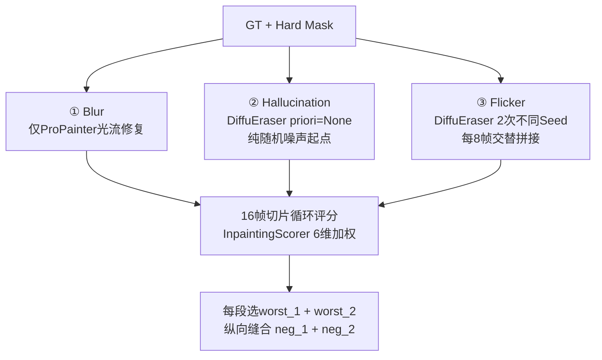

# Video Inpainting × DiffuEraser DPO 微调 — 项目完整报告

> **整合来源**：7 份技术文档 + 39 页 Research Deck PPT  
> **最后更新**：2026-04-04

---

## 目录

1. [论文全景](#1-论文全景)
2. [训练范式深度分析](#2-训练范式深度分析)
3. [Benchmark 体系与统一复现实验](#3-benchmark-体系与统一复现实验)
4. [SFT 全量微调经验](#4-sft-全量微调经验)
5. [DPO 数据集生成方案](#5-dpo-数据集生成方案)
6. [DPO 训练设计与实跑复盘](#6-dpo-训练设计与实跑复盘)
7. [实验路线图与下一步](#7-实验路线图与下一步)

---

## 1. 论文全景

> 基于 12 篇论文 + 开源代码仓库的综合分析

### 1.1 方法谱系

#### BR / 传播 / 扩散主线

| 方法 | 训练数据 | 核心逻辑 | 开源 |
|:---|:---|:---|:---:|
| **ProPainter** | YouTube-VOS (3471 videos) | 光流传播 + Transformer 补全 + 重叠子视频融合 | ✅ 推理完整 |
| **DiffuEraser** | Panda-70M (3.18M clips) | ProPainter prior + Diffusion denoise + blended refinement | ✅ 推理+训练 |
| **FFF-VDI** | YouTube-VOS | 先完成第一帧，再用 I2V Diffusion 传播 | ✅ |
| **FloED** | Open-Sora (421K clips) | 光流引导扩散 + anchor frame + latent interpolation | ✅ 仅推理 |
| **HomoGen** | Shutterstock (私有) | Homography propagation + Diffusion refinement | ❌ |
| **VideoComposer** | WebVid-10M + LAION-400M | STC-encoder 统一多条件，inpainting 只是子功能 | ✅ |

#### OR / 编辑主线

| 方法 | 训练数据 | 核心逻辑 | 开源 |
|:---|:---|:---|:---:|
| **MiniMax-Remover** | WebVid-10M + Pexels 10K | DiT 直接对象移除，CFG+MiniMax+蒸馏 | ✅ 仅推理 |
| **AVID** | Shutterstock (私有) | 文本驱动替换/移除/背景编辑 | ❌ |
| **CoCoCo** | WebVid-10M | 文本+mask 区域生成，强调文本对齐 | ✅ 仅推理 |
| **VideoRepainter** | 内部 300K videos | 用户先编辑关键帧，再 I2V 传播全视频 | ✅ 推理+训练 |
| **LGVI** | ROVI (5650 videos) | 自然语言指代目标定位并移除 | ✅ |
| **RT-Remover** | WebVid-10M + Pexels | 第一帧 mask → autoregressive 追踪+移除 | ❌ |
| **VACE** | Tongyi 内部大数据 | VCU 统一多任务输入，inpainting 为子任务 | ✅ 仅推理 |

### 1.2 任务类型：Metric 实际测量的 Task

> [!IMPORTANT]
> OR (Object Removal) 没有像素级 GT，无法计算 PSNR/SSIM。多数论文的 OR 只做可视化，metric 实际测的是 BR。

| 方法 | Metric 测的 Task | 备注 |
|:---|:---|:---|
| ProPainter / FFF-VDI / HomoGen | **BR** | 标准 stationary mask 评测 |
| DiffuEraser | **无定量 metric** | 论文仅可视化对比 |
| MiniMax / RT-Remover | **OR (背景保持度)** | PSNR/SSIM 仅测非 mask 背景区域 |
| FloED | **BR + OR** | 两个 task 均有定量 metric |
| AVID / CoCoCo | Text-guided inpainting | 无 PSNR/SSIM |
| VideoRepainter | Keyframe-guided editing | 测背景一致性+美学 |
| LGVI | Language-driven OR | 有完整 GT |

### 1.3 训练 Mask 类型（代码级验证）

> [!WARNING]
> **核心结论：训练时几乎所有方法都用随机 Mask，不使用 SAM 精确 mask。**

| 方法 | 训练 Mask 真实来源 | SAM? |
|:---|:---|:---:|
| ProPainter / DiffuEraser / FFF-VDI | `create_random_shape_with_random_motion` 贝塞尔曲线 | ❌ |
| HomoGen | 随机 stationary mask | ❌ |
| AVID | 随机 mask（论文描述可能误导） | ❌ |
| CoCoCo | instance-aware region selection（位置偏向实例，形状随机） | ❌ |
| VideoRepainter | SAM mask + **70% 变形**为 brush/rect/ellipse/circle | ⚠️ |
| VideoComposer | irregular(70%) + rectangle(20%) + uncrop(10%) | ❌ |
| MiniMax S1 | 随机 mask（正方向）+ SAM2 mask（**CFG 负方向**） | ⚠️ 仅做负方向 |
| MiniMax S2 | 人工筛选伪 GT（Xsucc），不再用 SAM | ❌ |

### 1.4 推理配置修正（代码与论文不一致项）

| 方法 | 问题 | 论文/原表 | 代码实际 |
|:---|:---|:---|:---|
| DiffuEraser | 推理步数 | 4-Step | CLI 默认 **2-Step**, `guidance_scale=0` |
| DiffuEraser | max_img_size | 1280 | CLI 默认 **960** |
| DiffuEraser | mask_dilation | 8 | CLI 默认 8，forward() 默认 4 |
| MiniMax | 推理步数 | 6/12/50 | 测试脚本默认 **12** |
| MiniMax | mask_dilation | 论文未明确 | 默认 **6** |
| MiniMax | CFG | 论文未明确 | **无 CFG 逻辑**（已蒸馏进权重） |

---

## 2. 训练范式深度分析

### 2.1 所有训练本质相同：自监督随机 Mask 挖洞再补

```
完整视频 V ──(mask M 遮挡)──> V_masked = V × (1-M) ──(模型推理)──> V_pred
                                                                      │
完整视频 V ──(作为 GT)───────────────> Loss = ||V_pred - V||²  <──────┘
```

### 2.2 OR 能力从哪里来？

**来源 1**：随机 Mask 训练积累的背景填充基底能力（所有方法共享）。

**来源 2**：OR 推理时全帧 Mask 消除物体信息 → 模型看不到物体 → 只能生成背景。

**来源 3**：MiniMax 特有的 CFG + MiniMax 优化 + 蒸馏。

### 2.3 MiniMax-Remover 训练流程（纠正版）

**Stage 1 — CFG 训练**：
```
正方向（c+）：随机 mask + 原始视频 GT → 学习背景补全
负方向（c-）：SAM2 object mask + 原始视频 GT → 学习"生成物体"的方向

推理 CFG：output = c+ + scale × (c+ - c-)
         = 背景补全方向 + 远离"生成物体"方向
```

**Stage 2 — 蒸馏 + MiniMax 优化**：
- 用 Stage 1 模型处理 17K 视频 → 人工筛选 10K 成功 removal 结果（伪 GT）
- 内部最大化：找对抗噪声 → 外部最小化：在 bad noise 下仍成功 removal
- CFG 蒸馏进权重 → 推理时无需 CFG

> [!IMPORTANT]
> **用 SAM mask + GT 做简单监督，模型学到的是"重建物体"（与 removal 矛盾）。**
> MiniMax 把 SAM mask 路径作为 CFG 负方向 — 标记"生成物体"的方向，让模型远离。

### 2.4 为什么一种训练能同时做 BR / OR / Editing

BR / OR / Editing **不是三种不同的学习目标**，而是同一个条件生成器在推理时的三种配置：

| 任务 | 推理 Mask | 推理条件 | 期望生成 |
|:---|:---|:---|:---|
| BR | 随机 stationary mask | 无 | 恢复背景 |
| OR | SAM2 tracking（全帧） | 无/负 token | 移除物体、补背景 |
| 物体替换 | 物体 mask | 文本描述 | 生成新物体 |
| 背景替换 | 背景 mask | 场景描述 | 换背景 |

效果差距巨大：MiniMax OR Succ **82.2%** vs CoCoCo 12.2% vs VideoComposer 7.8%。

---

## 3. Benchmark 体系与统一复现实验

### 3.1 社区已有 Benchmark

| Benchmark | Task | 被复用情况 |
|:---|:---|:---|
| **STTN/E2FGVI Protocol** | BR | **社区事实标准**，10+ 篇论文使用 |
| DAVIS+Pexels OR Protocol | OR | MiniMax/RT-Remover 各自定义，尚未标准化 |
| ROVI Dataset | Language-driven OR | 唯一公开 |
| 其余 (FloED/CoCoCo/VideoRepainter) | 各自定义 | 难以跨论文复用 |

> [!WARNING]
> **OR 方向至今缺少社区统一 Benchmark。**

### 3.2 本地统一 Benchmark 协议定义

| 协议 | 主要约束 | 回答的问题 |
|:---|:---|:---|
| `Native-Best-24G` | 单卡 24GB 可运行 | 24GB 下谁最强 |
| `Native-Best-Fix-240-432-24G` | 统一 432×240 | 去掉分辨率差异后谁最强 |
| `Native-Best-Fix-nFrames-24G` | 统一帧预算 | 去掉时序窗口差异后谁最强 |
| `Native-Best-Fix-nFrames-Fix-240-432-24G` | 同时固定 | **可比性最强，最适合做主表** |
| `Native-Best-FullRes-24G` | 真实 high-res 输入 | **最接近真实使用场景** |
| `Native-Best-Fix-240-432-FullRes-24G` | high-res 源 + 统一 432×240 | **最推荐的 BR 主表** |

### 3.3 最重要的三张 BR 表

> PPT 明确指出：主结论优先看这 3 张。

#### 表 1：Native-Best-FullRes-24G / BR（真实 high-res + native-style）

| Method | PSNR↑ | SSIM↑ | LPIPS↓ | Ewarp↓ | VFID↓ | TC↑ | Frames |
|:---|---:|---:|---:|---:|---:|---:|---:|
| ProPainter | **34.2067** | **0.9782** | 0.0162 | 10.2557 | **0.0806** | **0.9748** | 69 |
| MiniMax-Remover | 31.8785 | 0.9670 | **0.0173** | **6.5358** | 0.0850 | 0.9746 | 65 |
| DiffuEraser | 30.3474 | 0.9613 | 0.0173 | 11.3108 | 0.0964 | 0.9720 | 69 |
| FloED | 30.1085 | 0.9536 | 0.0276 | 5.5943 | 0.3402 | 0.9744 | 15 |

#### 表 2：Native-Best-Fix-240-432-FullRes-24G / BR（最推荐主表）

| Method | PSNR↑ | SSIM↑ | LPIPS↓ | Ewarp↓ | VFID↓ | TC↑ | Frames |
|:---|---:|---:|---:|---:|---:|---:|---:|
| ProPainter | **34.2067** | **0.9782** | 0.0162 | 10.2557 | **0.0806** | **0.9748** | 69 |
| MiniMax-Remover | 30.3931 | 0.9579 | 0.0188 | 6.8619 | 0.1040 | 0.9734 | 65 |
| DiffuEraser | 30.3591 | 0.9612 | **0.0173** | 11.3890 | 0.0952 | 0.9720 | 69 |
| FloED | 30.1468 | 0.9538 | 0.0271 | **5.5549** | 0.3190 | 0.9751 | 15 |

#### 表 3：Native-Best-Fix-240-432-24G / BR（低分辨率源对照）

| Method | PSNR↑ | SSIM↑ | LPIPS↓ | Ewarp↓ | VFID↓ | TC↑ | Frames |
|:---|---:|---:|---:|---:|---:|---:|---:|
| ProPainter | **35.5167** | **0.9813** | 0.0141 | 7.4734 | **0.0818** | 0.9703 | 69 |
| FloED | 32.4996 | 0.9660 | **0.0103** | **4.1395** | 0.1152 | **0.9740** | 15 |
| MiniMax-Remover | 31.4162 | 0.9622 | 0.0187 | 4.2674 | 0.1025 | 0.9685 | 67 |
| DiffuEraser | 31.3771 | 0.9646 | 0.0171 | 8.5671 | 0.1045 | 0.9674 | 69 |

### 3.4 补充 BR 表（FullRes 系列）

#### Native-Best-Fix-nFrames-FullRes-24G / BR

| Method | PSNR↑ | SSIM↑ | LPIPS↓ | Ewarp↓ | VFID↓ | TC↑ | Frames |
|:---|---:|---:|---:|---:|---:|---:|---:|
| ProPainter | **33.8962** | **0.9751** | 0.0177 | 9.4691 | 0.2375 | 0.9763 | 16 |
| MiniMax-Remover | 30.6123 | 0.9584 | 0.0201 | **5.5313** | 0.2547 | **0.9764** | 13 |
| DiffuEraser | 30.2752 | 0.9584 | **0.0175** | 10.1341 | 0.2677 | 0.9743 | 16 |
| FloED | 30.1928 | 0.9547 | 0.0265 | 5.5868 | 0.3199 | 0.9749 | 15 |

#### Native-Best-Fix-nFrames-Fix-240-432-FullRes-24G / BR（最严格控制变量）

| Method | PSNR↑ | SSIM↑ | LPIPS↓ | Ewarp↓ | VFID↓ | TC↑ | Frames |
|:---|---:|---:|---:|---:|---:|---:|---:|
| ProPainter | **33.8962** | **0.9751** | 0.0177 | 9.4691 | **0.2375** | **0.9763** | 16 |
| DiffuEraser | 30.3599 | 0.9594 | **0.0175** | 10.1945 | 0.2639 | 0.9751 | 16 |
| FloED | 30.2457 | 0.9544 | 0.0259 | **5.5687** | 0.3130 | 0.9749 | 15 |
| MiniMax-Remover | 29.1567 | 0.9455 | 0.0235 | 5.9205 | 0.3356 | 0.9744 | 13 |

### 3.5 Low-Res 系列补充 BR 表

#### Native-Best-Fix-nFrames-24G / BR

| Method | PSNR↑ | SSIM↑ | LPIPS↓ | Ewarp↓ | VFID↓ | TC↑ | Frames |
|:---|---:|---:|---:|---:|---:|---:|---:|
| ProPainter | **35.1758** | **0.9783** | 0.0157 | 6.7386 | 0.2269 | 0.9723 | 16 |
| FloED | 32.4986 | 0.9660 | **0.0103** | **4.1395** | **0.1149** | **0.9739** | 15 |
| MiniMax-Remover | 31.8848 | 0.9645 | 0.0219 | 3.2322 | 0.2712 | 0.9712 | 16 |
| DiffuEraser | 31.3740 | 0.9624 | 0.0174 | 7.2421 | 0.2495 | 0.9712 | 16 |

#### Native-Best-Fix-nFrames-Fix-240-432-24G / BR（Low-Res 可比性最强）

| Method | PSNR↑ | SSIM↑ | LPIPS↓ | Ewarp↓ | VFID↓ | TC↑ | Frames |
|:---|---:|---:|---:|---:|---:|---:|---:|
| ProPainter | **35.1758** | **0.9783** | 0.0157 | 6.7386 | 0.2269 | 0.9723 | 16 |
| FloED | 32.4986 | 0.9660 | **0.0103** | **4.1396** | **0.1149** | **0.9739** | 15 |
| DiffuEraser | 31.4963 | 0.9638 | 0.0165 | 7.2389 | 0.2644 | 0.9716 | 16 |
| MiniMax-Remover | 30.3754 | 0.9524 | 0.0220 | 3.5874 | 0.2927 | 0.9702 | 16 |

### 3.6 OR 表精选

#### Native-Best-24G / OR

| Method | PSNR(bg)↑ | SSIM(bg)↑ | TC↑ | Frames |
|:---|---:|---:|---:|---:|
| MiniMax-Remover | **29.1795** | **0.9597** | 0.9719 | 69 |
| ProPainter | 23.1751 | 0.8419 | 0.9582 | 71 |
| DiffuEraser | 21.2679 | 0.7879 | 0.9545 | 71 |
| FloED | 19.7665 | 0.7015 | **0.9768** | 15 |

#### Native-Best-Fix-nFrames-Fix-240-432-24G / OR（可比性最强）

| Method | PSNR(bg)↑ | SSIM(bg)↑ | TC↑ | Frames |
|:---|---:|---:|---:|---:|
| MiniMax-Remover | **25.9349** | **0.9216** | 0.9681 | 16 |
| ProPainter | 23.2990 | 0.8471 | 0.9620 | 16 |
| CoCoCo | 22.6760 | 0.8543 | 0.9572 | 16 |
| DiffuEraser | 21.2660 | 0.7943 | 0.9545 | 16 |

#### Native-Best-Fix-nFrames-24G / OR（FullRes，PPT 补充）

| Method | PSNR(bg)↑ | SSIM(bg)↑ | TC↑ | Frames |
|:---|---:|---:|---:|---:|
| ProPainter | 100.0000 | 1.0000 | 0.9620 | 16 |
| FloED | 62.4027 | 1.0000 | 0.9571 | 15 |
| DiffuEraser | 34.0971 | 0.9813 | 0.9622 | 16 |
| MiniMax-Remover | 27.8303 | 0.9409 | **0.9716** | 13 |

> [!WARNING]
> OR FullRes 表中 ProPainter/DiffuEraser 背景指标饱和（PSNR=100, SSIM=1.0），说明 blend 机制直接复制了 GT 背景，需配合 mask overlay 视频一起判断。

### 3.7 我们自己的 SFT 实验结果（BR）

| Weight | Config | PSNR↑ | SSIM↑ | LPIPS↓ | Ewarp↓ | AS↑ | IS↑ |
|:---|:---|---:|---:|---:|---:|---:|---:|
| **FT_S2_34K** | 2-Step_noblend | **31.9146** | **0.9690** | 0.0158 | 8.2150 | 5.2017 | 1.2172 |
| Orign | 2-Step_noblend | 31.8548 | 0.9685 | 0.0169 | 8.2049 | 5.1721 | 1.2185 |
| FT_S2_48K | 2-Step_noblend | 31.8409 | 0.9687 | 0.0160 | 8.1937 | 5.2035 | 1.2221 |
| FT_S2_34K | 4-Step_noblend | 31.4962 | 0.9662 | 0.0159 | 8.3854 | 5.2133 | 1.2148 |
| Orign | 4-Step_noblend | 31.1492 | 0.9642 | 0.0168 | 8.4732 | 5.1847 | 1.2187 |

> **结论**：`FT_S2_34K + 2-Step + no-blend` 是当前 BR 最稳配置。

### 3.8 DPO 微调 Baseline 选择结论

| 目标 | 推荐 | 理由 |
|:---|:---|:---|
| BR 冻结参考 baseline | **FloED** | 统一 benchmark 生成式方法中 BR 排名第一 |
| **BR DPO 微调主干** | **DiffuEraser** | 公开训练代码、改造成本最低、与现有工作流最兼容 |
| OR baseline | **MiniMax-Remover** | OR 表全面领先，但仅做评测参考 |

---

## 4. SFT 全量微调经验

> 基于 YouTube-VOS + DAVIS，Stage 1 (30K步) + Stage 2 (34K步) 全量微调。

### 4.1 八条踩坑教训

| # | 教训 | 后果 |
|:---|:---|:---|
| 1 | **路径规范**：禁止硬编码绝对路径 | 合作者 git pull 后 `FileNotFoundError` |
| 2 | **参数防呆**：训练开始前打印参数报表（total/trainable/frozen） | "跑了 3 天发现梯度被截断全冻结" |
| 3 | **指标对齐**：Stage 2 必须加 Ewarp/TC | 选出"每帧好但播放闪烁"的废弃权重 |
| 4 | **日志降噪**：屏蔽无用 INFO、Validation 只输出平均表 | 日志膨胀数十 MB 无法定位错误 |
| 5 | **WandB 最早初始化**：模型加载前完成 `init_trackers` | GPU 在烧但 Dashboard 空白 |
| 6 | **缓存隔离**：`WANDB_DIR`/`HF_HOME` 重定向到项目目录 | home 配额炸裂 `No space left on device` |
| 7 | **Tensor 维度校验**：`UNet2D` 期望 per-frame ts，`UNetMotionModel` 期望 per-batch ts | DPO concat 翻倍后 `expand` 崩溃 |
| 8 | **DPO 条件统一**：pos/neg 共享 GT masked image 做 BrushNet 条件 | 否则信息泄漏，模型学"条件图长什么样" |

### 4.2 WandB 监控体系

- **图表**：`dpo_loss`, `implicit_acc`, `mse_w/l`, `win/lose_gap`, `sigma_term`, `kl_divergence`, `dgr_grad_norm`, `grad_norm_ratio`, `lr`，以及 validation 均值指标
- **文本日志**：`stdout/stderr` → tee 到 `console_logs/rank*.log` → `policy="live"` 同步 WandB
- **Crash 回溯**：`wandb.alert()` + launcher 补传 `slurm_full_crash_output.out`
- **缓存路径**：`WANDB_DIR`/`WANDB_CACHE_DIR`/`WANDB_DATA_DIR`/`WANDB_CONFIG_DIR`/`HF_HOME` 全部重定向项目目录内

---

## 5. DPO 数据集生成方案

### 5.1 核心思想

| 角色 | 内容 |
|:---|:---|
| **正样本 (Win)** | Ground Truth 原始帧 |
| **负样本 (Lose)** | 三路退化管线中质量最差的修复结果 |

### 5.2 Mask 生成策略（`create_dpo_hard_mask`）

| 约束 | 设定 |
|:---|:---|
| 面积 | 宽高各占 75%~85%，实际白色像素 40%~50% |
| 位置 | 四周预留 15% 空气墙，Mask 永不触碰边界 |
| 运动 | 50% 静止 / 50% 以 0.5~1.5 像素/帧缓慢漂移 |

**设计动机**：大面积中央遮挡 → ProPainter 光流无法修复 → 生成严重模糊。

### 5.3 三路负样本管线



| 管线 | 缺陷特征 |
|:---|:---|
| **Blur** | Mask 区域模糊涂抹，缺乏纹理细节 |
| **Hallucination** | 生成与真实背景完全无关的幻觉内容 |
| **Flicker** | 每 8 帧背景风格剧变闪烁，100% 覆盖率 |

### 5.4 评分维度

| 维度 | 衡量内容 |
|:---|:---|
| `subject_consistency` | 前景主体时序一致性 |
| `background_consistency` | 背景时序一致性 |
| `temporal_flickering` | 帧间闪烁程度 |
| `motion_smoothness` | 运动平滑度 |
| `aesthetic_quality` | 美学评分 |
| `imaging_quality` | 成像质量 |

### 5.5 纵向缝合策略

**核心洞察**：评分粒度（16帧）= 训练采样粒度（16帧），纵向缝合后每段 16 帧都是该时段的极限负样本。DataLoader 无论裁到哪里都"刀刀见血"。

### 5.6 数据集规模

- **总量**：69.9GB（HF: JiaHuang01/DPO_Finetune_Data）
- **manifest**：2066 entries
- **训练样本**：5212 条（DAVIS ~1200 过采样后 + YTBV ~4012）

---

## 6. DPO 训练设计与实跑复盘

### 6.1 DiffuEraser 模型架构

| 组件 | 参数量 | 作用 |
|:---|:---|:---|
| UNet2DConditionModel | ~860M | 空间去噪主干 |
| BrushNet | ~886M | 条件编码器（masked image + mask） |
| MotionModule | ~120M | 时序一致性（temporal attention） |
| VAE | ~84M | 像素 ↔ latent |
| CLIP Text Encoder | ~123M | 文本条件 |

### 6.2 训练参数

| 参数 | Stage 1 | Stage 2 |
|:---|:---|:---|
| 可训练模块 | UNet2D + BrushNet (~1.75B) | MotionModule only (~120M) |
| Reference | 同结构冻结副本 (SFT 权重) | 完整模型 (SFT, 冻结) |
| LR | 1e-6 | 1e-6 |
| beta_dpo | 500（初版 2500 → 早饱和后下调） | 500 |
| nframes | 16 | 16 |
| max_steps | 20000 | 30000 |
| 验证指标 | PSNR + SSIM | PSNR + SSIM + Ewarp + TC |

### 6.3 关键设计决策

| 决策 | 选择 | 理由 |
|:---|:---|:---|
| BrushNet 条件 | pos/neg 共享 GT masked image | 防止信息泄漏 |
| DAVIS 过采样 | 10x | 平衡 DAVIS (~30) vs YouTube-VOS (~3400) |
| nframes | 16 | 对齐 DPO 数据集 chunk 大小 |
| 权重保存 | 仅 best + last | 节省 WandB 存储 |
| Chunk-Aligned 采样 | 对齐 16 帧 chunk 边界 | 避免跨缝合线 artifact 污染 loss |

### 6.4 已解决的 11 个 Bug

| # | 严重性 | 描述 | 修复 |
|:---|:---:|:---|:---|
| 1 | P0 | `UNetMotionModel` 未 import | 添加 import |
| 2 | P0 | manifest key ≠ 目录名 → 0 entries | `_load_manifest` fallback |
| 3 | P0 | Stage 1 timesteps `(2,)` vs noisy `(32,)` | `repeat_interleave(nframes)` |
| 4 | P0 | Stage 2 BrushNet vs UNetMotion 需不同 timesteps | 拆分 2D / motion 变量 |
| 5 | P0 | OOM (A100-80GB) | 4 项显存优化 |
| 6 | P0 | 权重 config `_class_name` 不兼容 | 自动检测 config 类型 |
| 7 | P1 | Stage 2 `hasattr` 缺失 | 双重保护 |
| 8 | P1 | `encoder_hidden_states` 未翻倍 | `.repeat(2, 1, 1)` |
| 9 | P1 | WandB 初始化过晚 | 提前到模型加载前 |
| 10 | P1 | WandB artifact 撑爆 home 配额 | 环境变量重定向 |
| 11 | P2 | DDP 多进程函数属性不安全 | 改局部变量 |

### 6.5 显存优化（DPO ≈ 4× SFT）

| 优化项 | 效果 |
|:---|:---|
| xformers (4 模型全启用) | 显著降低 attention 显存 |
| gradient_checkpointing (Policy) | 用计算换显存 |
| del BrushNet/Ref 中间特征 | 释放已消费 tensor |
| Ref forward 在 `no_grad()` 中 | 不产生计算图 |
| Fallback: nframes=8 | 显存减半（工程兜底，非正式设定） |

### 6.6 首次 Stage 1 实跑复盘（β=2500 早饱和）

**现象**：
- Step 1: `implicit_acc=0.25`（4/16 帧正确）
- Step 300: `implicit_acc=1.0`, `sigma_term=1.0`, `dpo_loss≈0`
- `win_gap` 长期为正 → policy 在 GT 上比 ref 更差
- 模型主要靠"让 loser 更差"拉开偏好差距


**关键结论**：
1. `implicit_acc=1.0` **不能单独解释为训练成功**
2. `beta_dpo=2500` 过激进 → 很快推 `inside_term` 到 sigmoid 饱和区
3. `win_gap > 0` → policy 在 GT 上并未优于 ref
4. 与 Reg-DPO 论文指出的 vanilla DPO 早饱和高度一致

### 6.7 修订后的监控指标体系

#### 排序与偏好指标

| Metric | 含义 | 健康范围 |
|:---|:---|:---|
| `inside_term` | sigmoid 输入 | 避免全面正饱和 |
| `dpo_loss` | `-log σ(inside_term)` | 应持续下降 |
| `implicit_acc` | 偏好满足比例（**跨卡全局**） | 0.6~0.85 |
| `sigma_term` | sigmoid 饱和度 | 0.5~0.9 |
| `win_gap` | winner=GT，理想 <0 | ≤ 0 |

#### 新增诊断指标

| Metric | 含义 |
|:---|:---|
| `inside_term_mean/min/max` | sigmoid 输入全局分布 |
| `loser_dominant_ratio` | 靠 loser 退化获胜的比例 |
| `dgr_grad_norm` / `grad_norm_ratio` | 梯度范数及比值 |

---

## 7. 实验路线图与下一步

### 7.1 正式实验前必须固定的 9 项

| # | 内容 | 理由 |
|:---|:---|:---|
| 1 | 固定主任务：BR 还是 OR | GT / mask / 指标完全不同 |
| 2 | 固定主表协议 | 优先 FullRes-24G BR 系列 |
| 3 | 负样本与训练窗口对齐 | nframes=8 必须标记为 fallback |
| 4 | Stage 2 采样避开 chimera 缝合线 | 防学伪时序断裂 |
| 5 | BrushNet 条件共用 GT masked image | 防信息泄漏 |
| 6 | Policy / Reference 共用 SFT 初始化 | DPO 增量同基线 |
| 7 | MotionModule 从 DiffuEraser baseline 初始化 | 不从 AnimateDiff 重起 |
| 8 | Stage 2 加 Ewarp / TC | 防选闪烁权重 |
| 9 | DAVIS 过采样先定死 | 数量远少于 YTVOS |

### 7.2 建议路线图

1. **锁定 BR 主 benchmark**：`Native-Best-FullRes-24G / BR` + `Native-Best-Fix-240-432-FullRes-24G / BR` + `Native-Best-Fix-240-432-24G / BR`
2. **以 SFT DiffuEraser 作为 0 号 baseline**做统一 benchmark
3. **`beta_dpo=500` 重新提交 Stage 1**
4. 重点监控 `global/implicit_acc`、`global/inside_term_*`、`rank0/win_gap`、`global/loser_dominant_ratio`
5. Stage 1 完成后提交 Stage 2
6. 若仍快速饱和 → 引入 Reg-DPO SFT regularization 项

### 7.3 当前状态

- ✅ Stage 1/2 代码审计完成，所有 11 个已知 Bug 修复
- ✅ DPO 数据集已构建（69.9GB，5212 训练对）
- ✅ WandB 异常捕获、crash 回溯、缓存隔离已落地
- ✅ 首次 Stage 1 试跑复盘完成，β=2500 → 500 修订完成
- ✅ 统一 Benchmark 12+ 张定量表已生成
- ⏳ 待重新提交 Stage 1（beta=500）
- ⏳ 待 DiffuEraser vs MiniMax FullRes 对比表完善

---

## Appendix A：论文原始 Metric 数值

### A.1 STTN/E2FGVI 协议（432×240, Stationary Mask）— BR

| 方法 | YT-VOS PSNR↑ | YT-VOS SSIM↑ | DAVIS PSNR↑ | DAVIS SSIM↑ |
|:---|:---:|:---:|:---:|:---:|
| E²FGVI | 33.71 | 0.9700 | 33.01 | 0.9721 |
| **ProPainter** | **34.43** | **0.9735** | **34.47** | **0.9776** |
| **FFF-VDI** | **35.06** | **0.9812** | **35.03** | **0.9834** |

### A.2 MiniMax-Remover 评测（DAVIS+Pexels, SAM2 Mask）— OR

| 方法 | DAVIS PSNR↑ | DAVIS VQ↑ | DAVIS Succ% | Pexels PSNR↑ | Pexels VQ↑ | Pexels Succ% |
|:---|:---:|:---:|:---:|:---:|:---:|:---:|
| ProPainter | 35.33 | 5.68 | 56.67 | 35.76 | 5.07 | 35.5 |
| DiffuEraser | 34.42 | 5.71 | 56.67 | 34.41 | 5.89 | 59.0 |
| **MiniMax(6步)** | **36.56** | **6.26** | **82.22** | **36.98** | **6.87** | **76.5** |

---

## Appendix B：代码文件清单

```
Reg_DPO_Inpainting/
├── DPO_finetune/
│   ├── dataset/dpo_dataset.py           DPO 偏好对数据集
│   ├── train_dpo_stage1.py              Stage 1 训练 (UNet2D + BrushNet)
│   ├── train_dpo_stage2.py              Stage 2 训练 (MotionModule)
│   └── scripts/
│       ├── run_dpo_stage1.py            Stage 1 Python 启动入口
│       ├── run_dpo_stage2.py            Stage 2 Python 启动入口
│       ├── 03_dpo_stage1.sbatch         Stage 1 SLURM 脚本
│       └── 03_dpo_stage2.sbatch         Stage 2 SLURM 脚本
├── finetune-stage2/
│   └── converted_weights_step34000/     SFT 最终权重
├── data/DPO_Finetune_data/              DPO 数据集 (69.9GB)
└── inference/metrics.py                 评估指标
```
