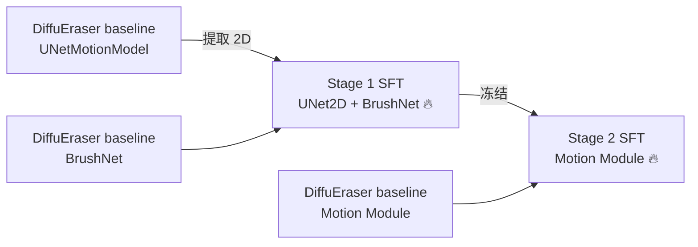

# SFT 训练管线增强 — 需求文档

## 1. 背景

在 DiffuEraser 的 SFT 训练管线中，为了更好地利用原作者大规模训练的能力，需要对训练流程进行四项增强：
1. Stage 1 的 UNet2D 从 DiffuEraser baseline 的 UNetMotionModel 中提取预训练 2D 权重
2. 训练开始时打印模型参数 debug 信息
3. Stage 2 validation 增加时序指标（VFID/Ewarp）
4. 日志清理，移除大量噪音输出

## 2. 修改文件列表

| 文件 | 修改内容 |
|------|----------|
| `libs/unet_motion_model.py` | `Forward upsample size` 日志从 INFO 降级为 DEBUG |
| `train_DiffuEraser_stage1.py` | 新增 `--baseline_unet_path` + 2D 权重提取 + debug 信息 + 表格 |
| `train_DiffuEraser_stage2.py` | VFID/Ewarp 时序指标 + debug 信息 + 表格 |
| `scripts/run_train_stage1.py` | 传递 `--baseline_unet_path` |

## 3. 使用方式

### Stage 1（合作者集群上）
```bash
BASELINE_UNET=/sc-projects/sc-proj-cc09-repair/hongyou/dev/Reg_DPO_Inpainting/weights/diffuEraser
```
`run_train_stage1.py` 默认自动从 `weights/diffuEraser` 加载 baseline 权重。

### Stage 2
不变，已在上一轮修改中完成 baseline motion module 加载。

## 4. 训练流程


