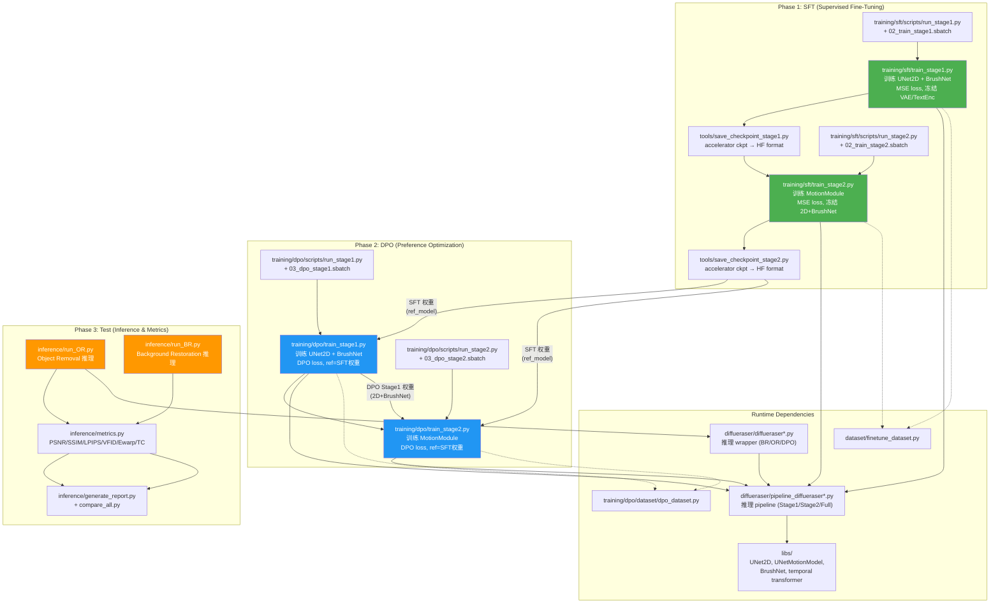

# H20_Video_inpainting_DPO 代码结构审查（重构后 v2）

> 基于 2026-04-18 04:24 代码快照

## ✅ 重构改进总结

**你做了一件正确的事：把代码组织从"文件堆叠"迁移到了模块化的 `training/` 结构。** 核心改进：

| 维度 | 重构前 | 重构后 |
|------|--------|--------|
| SFT 训练脚本位置 | 根目录 `train_DiffuEraser_stage{1,2}.py` (1200+行) | `training/sft/train_stage{1,2}.py`，根目录改为 stub |
| DPO 训练脚本位置 | `DPO_finetune/train_dpo_stage{1,2}.py` | `training/dpo/train_stage{1,2}.py`，旧目录改为 stub |
| DPO Dataset | `dataset/dpo_dataset.py` (死文件) + `DPO_finetune/dataset/` | `training/dpo/dataset/dpo_dataset.py`，旧路径改为 deprecation stub |
| 公共工具 | 每个文件重复定义 | `training/common/experiment.py` + `validation_metrics.py` |
| DPO loss | stage1/stage2 各自复制 | **stage2 import stage1**：`from training.dpo.train_stage1 import compute_dpo_loss, ...` ✅ |
| 工具脚本 | 根目录 `convert_checkpoint.py` | `tools/convert_checkpoint.py` + `save_checkpoint_stage{1,2}.py` |
| 向后兼容 | 无 | 旧位置全部改为 `runpy`/`import *` stub |

---

## 🔀 完整流水线追踪（SFT → DPO → Test）



---

## 📦 权重流转详解

### SFT Stage 1 → Stage 2
```
Stage1 输出: experiments/sft/stage1/<version>/
  ├── unet_main/    (UNet2DConditionModel)
  └── brushnet/     (BrushNetModel)

Stage2 加载:
  ├── UNetMotionModel ← baseline (含 MotionModule)
  ├── 2D 权重 ← Stage1 输出 (逐层拷贝 conv_in/down_blocks/mid_block/up_blocks/conv_out)
  └── BrushNet ← Stage1 输出 (冻结)
  → 仅训练 MotionModule (temporal layers)
```

### SFT → DPO
```
DPO Stage1 加载:
  ├── policy: UNet2D + BrushNet (待训练)
  └── ref:    UNet2D_ref + BrushNet_ref (SFT 权重，冻结)

DPO Stage2 加载:
  ├── policy: UNetMotionModel (2D from DPO-S1 + Motion from baseline)
  ├── policy BrushNet: DPO-S1 (冻结)
  ├── ref:    UNetMotionModel (SFT 完整权重，冻结)
  └── ref BrushNet: SFT 权重 (冻结)
  → 仅训练 MotionModule
```

---

## 🔍 DPO Loss 审查

[training/dpo/train_stage1.py](file:///home/hj/H20_Video_inpainting_DPO/training/dpo/train_stage1.py#L238-L322) 中的 `compute_dpo_loss` 实现正确：

```python
# 核心公式
scale_term = -0.5 * beta_dpo                         # effective β = β/2
inside_term = scale_term * (model_diff - ref_diff)    # DPO 判别项
loss = (-1.0 * F.logsigmoid(inside_term)).mean()      # DPO loss
```

**关键复用**: Stage 2 通过 `from training.dpo.train_stage1 import compute_dpo_loss, ...` 直接复用，避免了复制粘贴。这是一个 ✅ 正确做法。

### 诊断指标 (Reg-DPO 风格) ✅
- `win_gap` / `lose_gap`: policy vs ref 的 MSE 差异
- `reward_margin`: ref 在 win/lose 上的差异
- `loser_degrade_ratio`: 靠 loser 退化获胜的比例 (核心 Reg-DPO 指标)
- `inside_term` 统计: mean/min/max，支持跨卡 gather

---

## 📂 当前文件拓扑

```
H20_Video_inpainting_DPO/
│
├── training/                          ← 🆕 核心训练模块
│   ├── common/
│   │   ├── experiment.py              ← 实验目录版本化 + manifest
│   │   └── validation_metrics.py      ← PSNR/SSIM wrapper
│   ├── sft/
│   │   ├── train_stage1.py            ← SFT Stage1 (1217行)
│   │   ├── train_stage2.py            ← SFT Stage2 (1252行)
│   │   └── scripts/                   ← launcher + sbatch
│   └── dpo/
│       ├── train_stage1.py            ← DPO Stage1 (1340行)
│       ├── train_stage2.py            ← DPO Stage2 (985行)
│       ├── dataset/dpo_dataset.py     ← DPO 偏好对数据集
│       └── scripts/                   ← launcher + sbatch
│
├── tools/                             ← 🆕 工具脚本
│   ├── convert_checkpoint.py          ← accelerator ckpt → HF format
│   ├── save_checkpoint_stage{1,2}.py  ← stage-specific 快捷入口
│   └── score_inpainting_quality.py    ← VBench-based InpaintingScore
│
├── diffueraser/                       ← 推理 pipeline + wrapper
│   ├── pipeline_diffueraser.py        ← 全功能推理 pipeline (1349行)
│   ├── pipeline_diffueraser_stage1.py ← SFT Stage1 训练用 (1290行)
│   ├── pipeline_diffueraser_stage2.py ← SFT Stage2 训练用 (1280行)
│   ├── diffueraser.py                 ← BR 推理 wrapper
│   ├── diffueraser_OR.py              ← OR 推理 wrapper
│   └── diffueraser_OR_DPO.py          ← OR+DPO neg 生成 wrapper
│
├── libs/                              ← 模型架构定义
│   ├── unet_2d_condition.py / unet_motion_model.py
│   ├── brushnet_CA.py
│   └── unet_2d_blocks.py / unet_3d_blocks.py / transformer_temporal.py
│
├── dataset/                           ← SFT 数据加载
│   ├── finetune_dataset.py            ← SFT 训练用 Dataset
│   ├── dpo_dataset.py                 ← ⚠️ deprecation stub → training/dpo/dataset/
│   └── utils.py / file_client.py / img_util.py
│
├── inference/                         ← 推理 & 评估
│   ├── run_OR.py / run_BR.py
│   ├── metrics.py                     ← 全量指标 (PSNR/SSIM/LPIPS/VFID/Ewarp/TC)
│   ├── compare_all.py / generate_report.py
│   └── configs/                       ← 推理配置
│
├── propainter/                        ← ProPainter priori 模型 (外部依赖)
│
├── ─── 向后兼容 stubs ───
│   ├── train_DiffuEraser_stage{1,2}.py  ← runpy → training/sft/
│   ├── validation_metrics.py            ← import * → training/common/
│   └── convert_checkpoint.py            ← → tools/convert_checkpoint.py
│
├── DPO_finetune/                      ← ⚠️ 旧目录 (stub化但保留)
│   ├── train_dpo_stage{1,2}.py        ← runpy → training/dpo/
│   ├── dataset/dpo_dataset.py         ← 已不再被直接使用
│   └── scripts/                       ← 旧 sbatch (仍可用)
│
└── scripts/                           ← ⚠️ 旧 SFT launcher (stub化)
```

---

## ⚠️ 遗留问题（按优先级）

### 🟡 P1: `training/common/` 没有被训练脚本实际 import

| 文件 | 行数 | 被谁 import? |
|------|------|-------------|
| `training/common/experiment.py` | 133 | ❌ 无人 import |
| `training/common/validation_metrics.py` | 128 | ❌ 仅根目录 stub 导出，训练脚本各自 inline 定义 `format_metrics_table` |

> [!NOTE]
> `experiment.py` 的 `resolve_output_dir()` / `prepare_experiment_dir()` 设计得不错，但 SFT/DPO 训练脚本都没用。`validation_metrics.py` 的 `compute_batch_metrics` 也没被训练脚本的 `log_validation()` 调用——训练脚本内部各自重新写了 PSNR/SSIM 循环。
>
> **建议：** 如果短期不打算让训练脚本调用 common，可以先不管。但记录在案，避免以为已经去重。

### 🟡 P2: `diffueraser/pipeline_diffueraser*.py` — 3 份 1300 行文件仍 95% 重复

这是初次审查时就指出的问题，重构没有触及这个层面。

| 文件 | 行数 |
|------|------|
| `pipeline_diffueraser.py` | 1349 |
| `pipeline_diffueraser_stage1.py` | 1290 |
| `pipeline_diffueraser_stage2.py` | 1280 |

> 任何 bug fix 仍需同步 3 份文件。

### 🟡 P3: `diffueraser_*.py` wrapper — 3 份 600 行文件仍 90% 重复

| 文件 | 行数 |
|------|------|
| `diffueraser.py` | 606 |
| `diffueraser_OR.py` | 592 |
| `diffueraser_OR_DPO.py` | 612 |

### 🟢 P4: 旧目录可进一步清理

- `DPO_finetune/` 目录已 stub 化，但仍保留 `.md` 文档和 `dataset/dpo_dataset.py`（23KB 旧代码）
- `scripts/` 目录已 stub 化
- 这些目录的 `__pycache__/` 还在

> **建议：** 如果确认没有外部 CI/CD 或脚本引用旧路径，可以考虑删除 `DPO_finetune/` 和 `scripts/` 的旧代码体（保留 stub 即可）。

### 🟢 P5: SFT 训练脚本之间仍有大量重复

`training/sft/train_stage1.py` vs `training/sft/train_stage2.py` 之间 `parse_args`/`collate_fn`/`log_validation` 等函数 **~600 行 80%+ 重复**。DPO stage2 已经通过 `from training.dpo.train_stage1 import ...` 实现了部分去重，但 SFT 侧还没做这个。

### 🟢 P6: `PROJECT_ROOT` 在 DPO 训练脚本中重复定义

`training/dpo/train_stage1.py` 中有两次 `PROJECT_ROOT` 定义：
- Line 33: `PROJECT_ROOT = Path(__file__).resolve().parents[2]`
- Line 66: `PROJECT_ROOT = os.path.dirname(os.path.dirname(os.path.abspath(__file__)))`

第二次使用 `os.path` 会指向 `training/` 而非项目根目录（`parents[1]` = `training/dpo/` 的父级 = `training/`）。虽然 `sys.path` 已经被 Line 17 正确设置了，路径不影响运行，但代码容易误读。

---

## ✅ 结论

**重构质量 7/10**。核心逻辑正确，模块化方向正确，向后兼容 stub 处理得体。主要不足是：
1. `training/common/` 写好了但没被实际调用
2. `diffueraser/` 层的重复代码没有触及（这个改动风险确实最高，合理推迟）
3. SFT 侧还没有做 DPO 侧那样的跨模块 import 去重

**如果你的目标是先跑通 Reg-DPO 实验，当前代码结构已经足够支撑，不需要再重构了。**

---

*审查基于 2026-04-18 04:24 代码快照*
